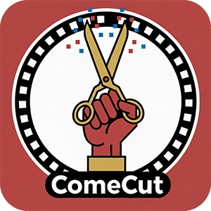
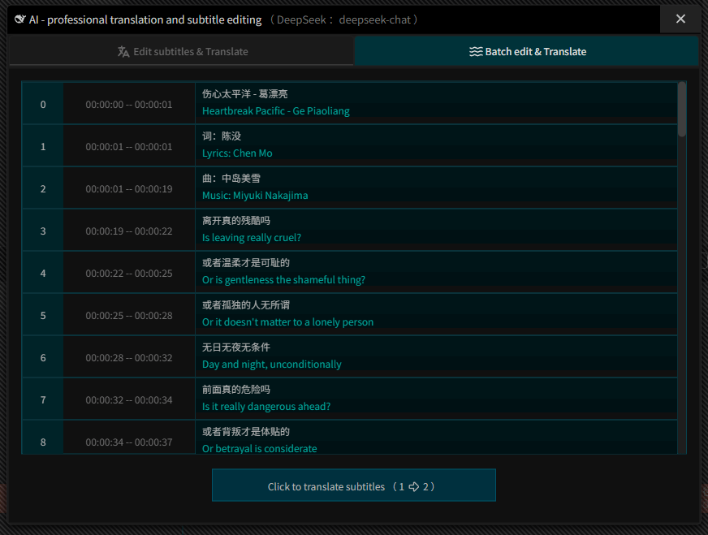

👉🏻 <a href="https://juntaosun.github.io/ComeCut/" target="_blank" rel="noopener noreferrer">ONLINE DEMO</a> 

<h2 align="center" style="margin-top: -15px;">ComeCut「来剪」</h1>

<h3 align="center" style="margin-bottom: -15px;">
<b>⭐Free & Easy-to-use Video Editor for Web, Desktop</b></a>
</h3>

<h3 align="center">
<a href="README.md"><b>English</b></a> | <a href="README_ZH.md"><b>中文</b></a>
</h3>

## 🎁 Why ComeCut ?  
Our vision is to fully integrate the power of the open source community to create a truly free, open, and scalable AI video editing ecosystem that benefits everyone.  

✅ Completely free: unlimited use.  
✅ No registration required: no strings attached.  
✅ Privacy and security: fully localized.  
✅ Intelligent fusion: using advanced AI.  
✅ A powerful video editor.  

## ✨ Supports 100+ global APIs and large models  

## ✨ AI Subtitle translation (SRT/VTT/LRC)   

> Dual-language subtitles one-click translation  

  

## ✨ AI Voice Recognition Subtitles (In Progress)  
> Voice track recognition generates subtitles  

## ✨ AI Video Translation and Dubbing (In Progress)  
> English TV series/Korean dramas/Japanese dramas --> One-click translation into Mandarin dubbing  

## ✨ AI Short Drama Creation (In Progress)  
> Future integration will include: seedance-2.0, veo3.1, sora2, etc.  
> Easily create your AI short dramas/AI comics/AI creative works  

## ⚡ Online Demo    
| Windows | MacOS | Linux |  
| --- | --- | --- |  
| ✅ beta | ✅ beta | ✅ beta |   
> 👉🏻 <a href="https://juntaosun.github.io/ComeCut/" target="_blank" rel="noopener noreferrer">[ Canary build online demo ]</a>   

## 💬 Discuss with us  
-  This is an early stage project under rapid development. 
-  Right now, it’s still young! We have lots of great, new and fun creative ideas and are working hard to build it out!      
-  If you have any questions about this project, or would like to contribute, please feel free to contact us in Issues!    

## 👏 News

- **[2025-09-07]** 🚀 **ComeCut project started!** 

show more

## 🛡️ Privacy  
- ComeCut does not collect any personal data.  
- All the data is stored locally in the browser storage. You can verify it yourself.     

## 📝 Contributing

**Note**: We appreciate the interest, it's recommended to wait until the project stabilizes before contributing to avoid conflicts and wasted effort.  

## 🔑 License

Copyright 2025 juntaosun, and other contributors

This program is free software: you can redistribute it and/or modify it under the terms of the GNU Affero General Public License as published by the Free Software Foundation, either version 3 of the License, or (at your option) any later version.

>**Disclaimer**：ComeCut is an open-source project intended for educational learning and research purposes. Please ensure that your use complies with the terms of this license and strictly follows local laws and regulations. You are solely responsible for your use of ComeCut.  

## 📚 Citation   

🌟 If you find our work helpful, please leave us a star⭐⭐⭐⭐⭐. 

