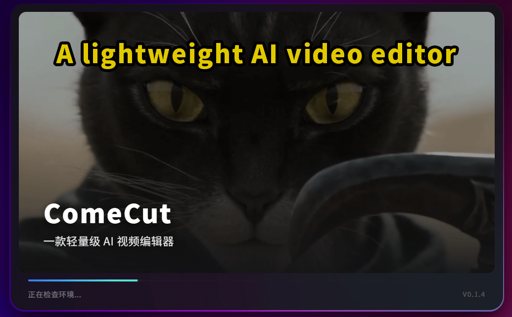
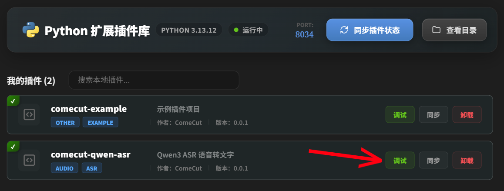
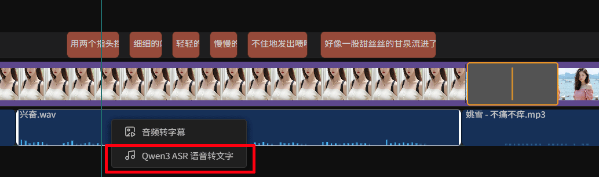
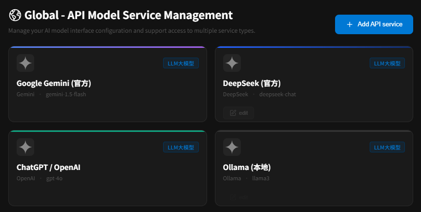
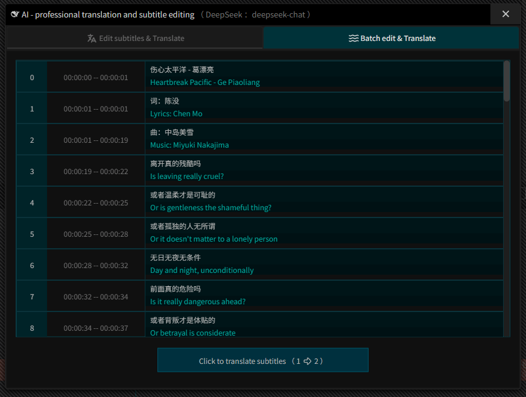
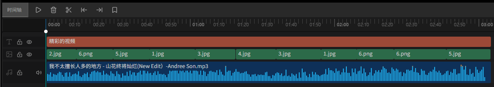

  
  <h1>ComeCut 「来剪」</h1>
  
<b>A Free, Lightweight, and AI-Powered Video Editing Suite for Web & Desktop</b>

  

    
    
    
    
  

  <h3>
    <a href="README.md">English</a> | <a href="README_ZH.md">简体中文</a> | <a href="https://github.com/juntaosun/ComeCut/releases">releases</a>  
  </h3>

---

  

## 🎁 Why ComeCut?

Our vision is to empower everyone with a professional-grade, AI-enhanced video editing experience. By leveraging the open-source community, we provide a truly free and scalable ecosystem.

*   ✨ **Completely Free**: No hidden costs, unlimited usage.
*   🚀 **No Registration**: Start creating immediately—no account required.
*   🔒 **Privacy First**: Fully localized processing ensures your data stays yours.
*   🤖 **AI-Driven**: Seamlessly integrates state-of-the-art AI models.
*   🎨 **Powerful Tools**: A full-featured editor right in your browser or desktop.
*   👉 **ComfyUI**: It now supports workflows such as z-image, qwen-edit, klein, and ltx2.*   
> Note: The ComfyUI workflow requires some simple setup to handle input control~  
Z-Image, Flux-2-klein-4b/9b    
Qwen-Image-Edit-2509/2511    
Wan2.1, Wan2.2, LTX-2.3    
*   🍌 **Nano banana**: Google Gemini banana is now supported for the following graph model:       
> gemini-2.5-flash-image    
gemini-3-pro-image-preview   
*   🤗 **ASR**: Web platform audio to text, now available!   

*   👉 **Ultra-Fast Cutout**: Integrated cutout, one-click instant cutout, hair-level cutout!  
*   👉 **GIF GIFs**: Integrated GIF export for one-click generation, enjoy playing with GIFs and emojis!  

*   👉 **Transition Engine**: A brand-new transition engine is ready—over 100 transition effects are coming soon!  
> Support for creating custom transitions is now available, and Agent mode will be integrated in a future update.  
*   👉 **Effects Engine**: A brand-new effects engine is ready—over 100 filter effects are coming soon!  
> Customization and filter features are currently under development ~  
*   👉 **Efficient Controls**: A completely new control experience—pan, rotate, and scale with greater freedom!  

> Note: It downloads the model from huggingface.co       
*   ⬇️ **Desktop version**: The desktop version (Windows) has been successfully compiled and is now available for download!      

> To keep you up-to-date, the developer version is set to expire automatically after 30 days.  

---

## ✨ Highly Flexible Python Native Extensions

I'm thrilled that in this update, I've achieved the epic completion of native Python extensibility support. This means that in the future, you'll have access to open-source community plugin support, just like ComfyUI, such as Track Audio to Subtitle ASR (already implemented). You can fully develop and extend your own plugins, allowing you to use the latest models and technologies in your video editor and share them with friends and others, improving your workflow!  

  

- All plugins come with a full-featured debugging mechanism, making your plugin development smoother!  

  

- Once the plugin is loaded: it will automatically appear in the track's right-click menu, for example: Audio/Video/Image!  
- Plugin development example project:  
https://github.com/juntaosun/comecut-example  
https://github.com/juntaosun/comecut-qwen3-asr  

## ✨ AI-Powered Ecosystem

### 🌐 100+ Global APIs & Large Models
ComeCut integrates with the world's leading AI providers to bring you the latest in generative video and audio technology.

  

### 📝 Smart Subtitle Translation (SRT/VTT/LRC)
Effortlessly translate subtitles into multiple languages with one click, supporting dual-language display.

  

  

---

## 🗺️ Roadmap (In Progress)

- [ ] 🎙️ **AI Voice Recognition**: Automatically generate subtitles from audio tracks.
- [ ] 🎭 **AI Creative Studio**: Integration with `Seedance-2.0`, `Veo3.1`, `Sora2` for AI short dramas and comics.
- [ ] 🎬 **AI Video Translation & Dubbing**: One-click localized dubbing (e.g., English to Mandarin).

---

## ⚡ Get Started

### Online Demo
Try the latest canary build directly in your browser:
👉 **[Canary Build Online Demo](https://juntaosun.github.io/ComeCut/)**

| Windows | MacOS | Linux |
| :---: | :---: | :---: |
| ✅ Beta | ✅ Beta | ✅ Beta |

---

## 💬 Community & Support

- 🌟 **Early Stage**: This project is growing fast! We have many exciting features in the pipeline.
- 💡 **Feedback**: Have an idea or found a bug? Open an [Issue](https://github.com/juntaosun/ComeCut/issues)!
- 🤝 **Contributing**: We appreciate your interest! We recommend waiting for the project to stabilize before making major contributions.

## 👏 News
- **[2026-08-12]** 🚀 **release v0.1.5** 
- **[2026-06-13]** 🚀 **release v0.1.4**  
- **[2026-06-10]** 🚀 **release v0.1.3**  
- **[2026-06-06]** 🚀 **release v0.1.2**  
- **[2026-06-05]** 🚀 **release v0.1.1**  
- **[2026-05-18]** 🚀 **Compiled desktop version, website showcase, documentation, and changelog.**    
- **[2025-09-07]** 🚀 **ComeCut project officially started!**

View More

...

---

## 🛡️ Privacy & Security
- **No Data Collection**: We don't track you or collect personal information.
- **Local Storage**: All project data is stored in your browser's local storage or your local machine.
- **API Access**: You are responsible for the privacy of the API model and the third-party API and you.  

## 🔑 License
Copyright © 2025 **juntaosun** and contributors.
Licensed under the [GNU Affero General Public License v3.0](LICENSE).

> **Disclaimer**: ComeCut is for educational and research purposes. Users are responsible for complying with local laws and the terms of this license.

---

  <b>If you find ComeCut helpful, please give us a star! ⭐⭐⭐⭐⭐</b>

