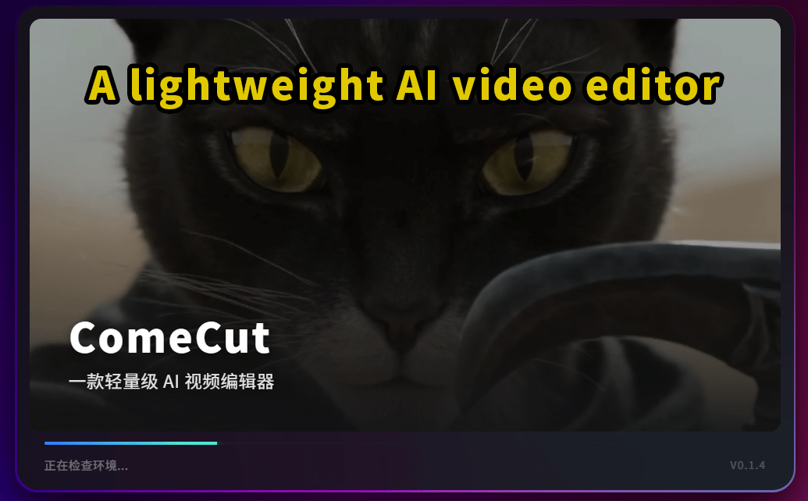
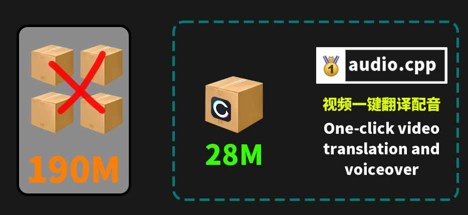
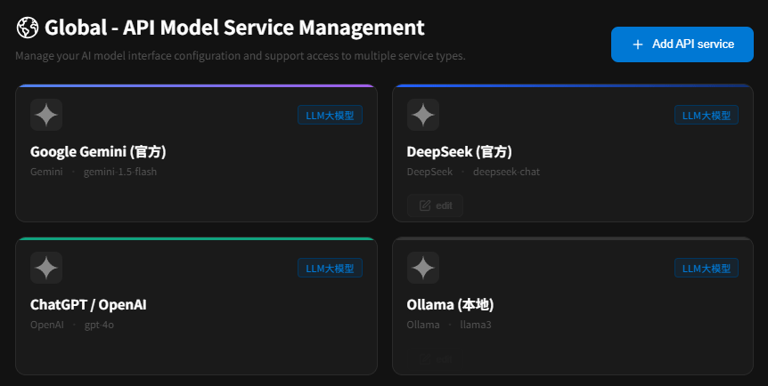
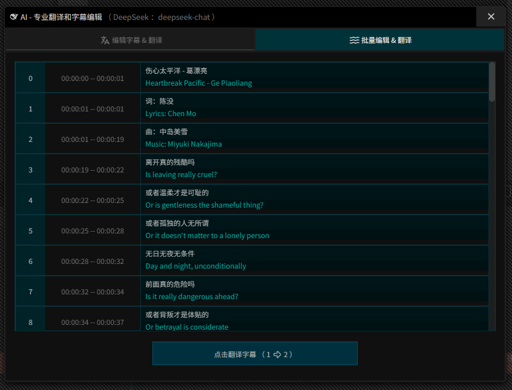
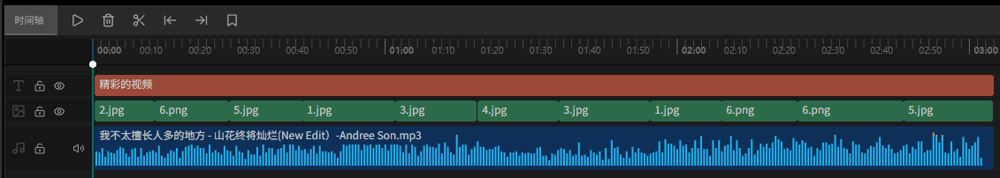

  
  <h1>ComeCut 「来剪」</h1>
  
<b>免费、轻量、AI 驱动的全平台视频编辑工具（网页版 & 桌面版）</b>

  

    
    
    
    
  

  <h3>
    <a href="README.md">English</a> | <a href="README_ZH.md">简体中文</a> | <a href="https://github.com/juntaosun/ComeCut/releases">releases</a>  
  </h3>

---

  

## 🎁 为什么选择 ComeCut?

我们的愿景是：充分整合开源社区的力量，打造一个真正免费、开放、可扩展的 AI 视频编辑生态系统，惠及所有人。

*   ✅ **完全免费**：无任何使用限制，无隐藏付费。
*   🚀 **无需注册**：即开即用，保护您的使用隐私。
*   🔒 **本地安全**：数据完全本地化处理，安全可靠。
*   🤖 **AI 赋能**：深度集成前沿 AI 模型。
*   🎨 **功能强大**：提供媲美专业软件的视频编辑体验。
*   👉 **ComfyUI**: 现已支持 z-image, qwen-edit, klein, and ltx2.* 等工作流。   
> 备注：ComfyUI 工作流需要进行一些简单的设置以便能处理输入控制~  
Z-Image, Flux-2-klein-4b/9b    
Qwen-Image-Edit-2509/2511    
Wan2.1, Wan2.2, LTX-2.3     
*   🍌 **Nano banana**: 现已支持谷歌Gemini 香蕉（Nano banana）生图模型如下:     
> gemini-2.5-flash-image  
gemini-3-pro-image-preview  
*   🤗 **ASR**: Web平台音频转文本,现在可用了!           
> 说明: 默认从 huggingface.co 下载模型!  

*   👉 **极速抠图**: 集成抠图，一键秒抠，发丝级别！     
*   👉 **GIF动图**: 集成 GIF 动图导出，一键生成，畅玩动图/表情包！
      
*   👉 **转场引擎**: 全新转场引擎已搭建完成，任意 100+ 转场效果，即将到来！     
> 现在支持新建自定义转场，后续将接入 Agent 模式 ~  
*   👉 **特效引擎**: 全新特效引擎已搭建完成，任意 100+ 滤镜效果，即将到来！    、
> 自定义以及滤镜功能，正在构建中 ~   
*   👉 **高效操作**: 全新控操体验，平移，旋转，缩放，更自由！      

*   ⬇️ **桌面版本**: 桌面版(Windows)已成功编译,现在可以下载使用了!    

> 为了让您保持体验最新版本, 开发版设置为30天自动过期.   

  

## ✨ 2026-10-05 里程碑: 全自动配音 和 更小的打包体积;  
(1) 全自动配音: 已经初步实现将任意视频,一键翻译成中文或英文 配音.  预览版已经支持了 audio.cpp 的 API 接入, 基于 OpenAI 标准协议; 现在它支持 index-tts2或2.5, Breeze-TTS2, OmniVoice,Qwen3-ASR等前沿TTS配音模型.  
(2)音频分离和还原: 当我得知某软件连这个基本功能都要收费,我彻底无语,所以,本次更新增加了剪辑块的"分离音频"和"还原音频",在任意视频剪辑块右键菜单上,可以找到它.  
(3)支持 audio.cpp: 将你添加它的模型时, 它会自动出现在你的右键菜单上.比如 Qwen3-ASR, IndexTTS2.5等.  
> https://github.com/0xShug0/audio.cpp   
(4)更小的打包体积: 原先我想把前沿的大模型集成进来,但光各种依赖环境就撑爆了包体积, 现在我将它们分离出去,仅使用 API 进行本地调用.真是天才般的想法!  

## ✨ Your AI Assistant  

很高兴,终于在视频编辑中高度集成了 AI 助手能力,它能帮你找素材,帮你剪辑,调整音量,修改字幕,翻译字幕,调用ComfyUI生成图片和视频,这一切都在 Agent 聊天中进行.    

  

  

---  
👉 AI 助手, 它能做什么?   
- 请将当前字幕翻译成英文  
- 帮我找到字幕中的错别字并修正它们    
- 帮我找到音乐并添加到轨道上  
- 帮我用 ComfyUI 生成一个美丽的女孩 
- 帮我找到某个字幕并将时间轴定位它  
- 删除某个剪辑,裁剪某个剪辑
- 帮我把某个音乐添加到轨道上,调整音量为 50%    
- 帮我保存项目  
- 你想做的事都可交给它...  
- 这就是你的 AI 助手, 它无所不能 !  

  
> AI助手: 支持Gemini, OpenAI 等协议, 例如 Qwen3.8, 以及本地 Ollama 和 LM Studio !  

---

## ✨ AI 驱动的生态系统

### 🌐 支持全球 100+ API 大模型
ComeCut 接入了全球顶尖的 AI 能力，让您在剪辑过程中随时调用最强的生成式 AI。

  

### 📝 AI 字幕翻译 (SRT/VTT/LRC)
双语字幕一键翻译，支持多种格式，让跨语言创作变得轻而易举。

  

  

---

## 🗺️ 路线图 (进行中)

- [ ] 🎙️ **AI 语音识别**：自动将语音轨道识别并生成字幕。
- [ ] 🎭 **AI 自由创作**：未来将接入 `Seedance-2.0`, `Veo3.1`, `Sora2` 等，轻松创作 AI 短剧/漫剧。
- [ ] 🎬 **AI 视频译制配音**：支持美剧/韩剧/日剧等一键译制成国语配音。

---

## ⚡ 在线演示

### 立即体验
无需安装，直接在浏览器中试用：
👉 **[在线演示入口](https://juntaosun.github.io/ComeCut/)**

| Windows | MacOS | Linux |
| :---: | :---: | :---: |
| ✅ Beta | ✅ Beta | ✅ Beta |

---

## 💬 交流与贡献

- 🌟 **早期阶段**：这是一个快速发展的项目，我们有许多新颖有趣的创意正在实现中。
- 💡 **反馈建议**：如果您有任何疑问或想法，欢迎通过 [Issues](https://github.com/juntaosun/ComeCut/issues) 与我们联系！
- 🤝 **参与贡献**：感谢您的关注，建议在项目进入稳定版本后再进行大规模代码贡献。

## 👏 最新动态
- **[2026-10-05]** 🚀 **release v0.1.8**  
- **[2026-09-14]** 🚀 **release v0.1.7**  
- **[2026-08-30]** 🚀 **release v0.1.6**  
- **[2026-08-12]** 🚀 **release v0.1.5**  
- **[2026-06-13]** 🚀 **release v0.1.4**  
- **[2026-06-10]** 🚀 **release v0.1.3**  
- **[2026-06-06]** 🚀 **release v0.1.2**    
- **[2026-06-05]** 🚀 **release v0.1.1**    
- **[2026-05-18]** 🚀 **编译桌面版本、网站展示，文档和更新日志。**
- **[2025-09-07]** 🚀 **ComeCut 项目正式启动！**

查看更多

...

---

## 🛡️ 隐私声明
- **无数据收集**：ComeCut 不会收集您的任何个人隐私数据。
- **本地存储**：所有创作数据均存储在您的本地浏览器或本地磁盘中。
- **API接入**：API大模型由您自行接入, 其隐私由第三方API和您自行负责。  

## 🔑 许可证
版权所有 © 2025 **juntaosun** 及其他贡献者。
本程序基于 [GNU Affero General Public License v3.0](LICENSE) 协议。

> **免责声明**：ComeCut 仅用于教育学习和研究用途。请确保您的使用符合当地法律法规。

---

  <b>如果您觉得 ComeCut 对您有帮助，请点个 Star 鼓励一下！ ⭐⭐⭐⭐⭐</b>

